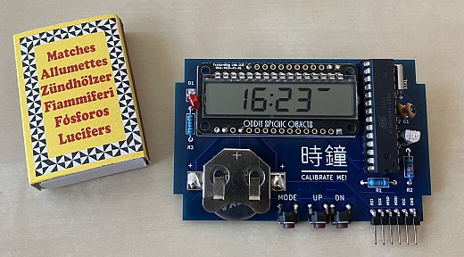
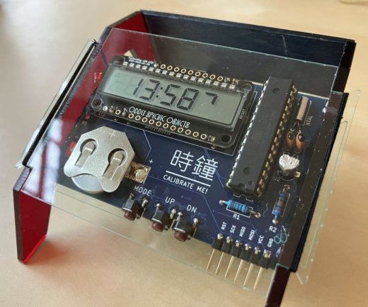

# Remarkably Accurate Quartz Clock

This repository has all the code and design files for the Remarkably Accurate Quartz Clock
[documented on Hackaday](https://hackaday.io/project/190063-remarkably-accurate-quartz-clock).

Can I use cheap, everyday components and build a quartz clock that beats specialized RTCs and matches the best commercial timepieces? Let's find out!

32kHz quartz crystals typically have a ±20ppm (parts per million) frequency tolerance, which translates to drift potentially in excess of 10 minutes per year. Specialized RTCs like DS3231 promise ±2ppm, or about ±1 minute per year.

RAQC aims for drift below 10 seconds per year. To achieve this, it implements fine-grained frequency correction in software. It has a screen to adjust time with subsecond precision, and it measures the temperature at 10-minute intervals to compensate for dynamic drift. After calibrating repeatedly at incresingly long intervals, RAQC knows the crystal's static error with a 0.01ppm precision.

Energy-saving programming techniques and a low-power LCD display keep the clock's current draw under 15μA, promising 1.5 years of uptime on a CR2032 coin cell.

## Electronics

The KiCad 5.1.9 schematic and PCB are in [/electronics](electronics). The ZIP file there is the Gerber export that I submitted to the PCB fab.

## Laser-cut frame

The frame is laser-cut from 3mm acryclic; the top and bottom covers are 1mm transparent acrylic. The front panel with the engraved overview of the clock's menu is laser-cut from 2mm birch.
The vector files for this are in [/design](design). The .ai file is the original, but I included a version re-saved as Inkscape .svg as well.

## Source code

The source code is in [/code/board](code/board). I developed it using the [PlatformIO extension](https://platformio.org/install/ide?install=vscode) for Visual Studio Code, so if you want to explore the code and build it yourself, that might be the easiest way to get started. The code uses the Arduino framework. It has only one dependency, the Wire library for I2C communication.
